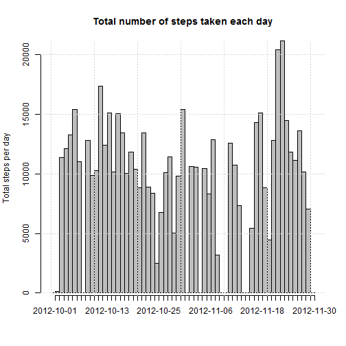
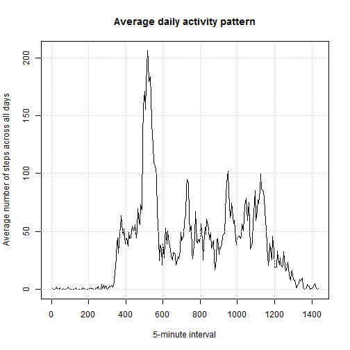
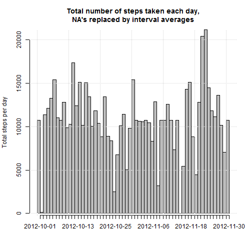
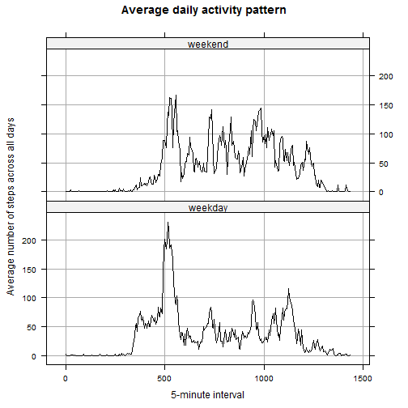

Written by Kaspar Jenni on 03/15/2015

Peer assignement 1 for Coursera's Reproducible Research course.

## Loading and preprocessing the data

After setting the working directory to the [cloned](https://github.com/kasparjenni/RepData_PeerAssessment1) github repository (forked from [here](http://github.com/rdpeng/RepData_PeerAssessment1)), we shall start by unzipping the archive.


```r
if(!file.exists(".\\data")){
  dir.create(".\\data")
  unzip("activity.zip", exdir=".\\data")
  print("unzipping activity.zip")
}else print("directory already exists, skipping unzipping")
```

For convenience, we add an index to the data. We also correct the format of the 5 minute interval as 100 represents 1 hours (without this, there will be a hole at the end of every hour). There are 288 5-minute intervales in a day (ranging from interval 1: 0x288=0 minute to interval 288: 287x5=1435 minutes).


```r
library(dplyr)
data<-read.csv(".//data//activity.csv")
data<-tbl_df(data)
data<-mutate(data, index=seq(from=1, to=dim(data)[1]))
data<-mutate(data, interval=(interval%%100)+60*floor(interval/100))
```

## What is mean total number of steps taken per day?

We shall sum the number of steps per day. 

```r
by_date<-group_by(data,date)
sum_by_date<-summarise(by_date, sum=sum(steps, na.rm=TRUE))
```

From this data we shall make a histogram of the number of steps taken each day.

```r
barplot(sum_by_date$sum, space=0, ylab="Total steps per day", main="Total number of steps taken each day")
axis(side=1, tick=TRUE, label=sum_by_date$date, at=seq_along(sum_by_date$date))
grid(nx = NULL, ny = NULL, col = "lightgray", lty = "dotted")
```

 

The mean of the total number of steps taken per day is 9354.23.
The median of the total number of steps taken per day is 10395.

## What is the average daily activity pattern?

We shall average the number of steps for each interval across all the days.

```r
by_interval<-group_by(data,interval)
average_by_interval<-summarise(by_interval, average=mean(steps, na.rm=TRUE))
```

From this data we shall plot a time series of the 5-minute interval and the average number of steps taken, averaged across all day.


```r
plot(average_by_interval$interval, average_by_interval$average, type="l", xlab="5-minute interval", ylab="Average number of steps across all days", main="Average daily activity pattern")
grid(nx = NULL, ny = NULL, col = "lightgray", lty = "dotted")
```

 

The 5-minute interval that, on average across all the days in the dataset, contains the maximum number of steps is the interval starting at minute 515.

## Imputing missing values

The number of missing values in the data set is 2304. The missing values are only steps. 

To fill in these missing values, we shall use the averages for the full data set of the corresponding 5 minute interval.
First we shall copy it to a new variable. The strategy is to isolate data with missing value, and merge this subarray with the previous array of average steps.  Then the data is rearranged to match the initial order (which was changed by the merging operation), and finally the NA's in the original data are overwritten by the arranged averages of the subarray.


```r
data_noNA<-data
missing<-is.na(data_noNA$steps)
temp_missing<-merge(data_noNA[missing,], average_by_interval, by="interval")
temp_missing<-arrange(temp_missing,index)
data_noNA$steps[missing]<-temp_missing$average
```

After these operations, there are 0 NA in the data.

We shall sum the number of steps per day.

```r
by_date<-group_by(data_noNA,date)
sum_by_date_noNA<-summarise(by_date, sum=sum(steps))
```

And make a second histogram using the same code as previouly.

```r
barplot(sum_by_date_noNA$sum, space=0, ylab="Total steps per day", main="Total number of steps taken each day,\nNA's replaced by interval averages")
axis(side=1, tick=TRUE, label=sum_by_date_noNA$date, at=seq_along(sum_by_date_noNA$date))
grid(nx = NULL, ny = NULL, col = "lightgray", lty = "dotted")
```

 

The mean and median of the total number of steps taken per day is:  

| |Mean | Median |
|:--- |:---- |:----:|
|with NA's| 9354.23 | 10395 |
|without NA's| 10766.19 | 10766.19 |

As we can see, the mean and median differ from the earlier ones. The reason is that we have added the mean of the whole period for the corresponding interval. If we had replaces NA's with the mean of all intervals for the corresponding day, the mean would have stayed identical but the median would still have moved. Alternatively, replacing NA's with the median of all intervals for the corresponding day would have conserved the median but not the mean. The new mean and median are identical to each other.

## Are there differences in activity patterns between weekdays and weekends?

First we shall add the corresponding day of the week in a new variable. Then we shall add a factor variable with *weekday* and *weekend* as levels.

```r
data_noNA$date<-as.POSIXct(data_noNA$date)
data_noNA<-mutate(data_noNA, weekday=weekdays(data_noNA$date))
data_noNA<-mutate(data_noNA,weekend=(weekday=="Saturday"|weekday=="Sunday"))
data_noNA$weekend<-factor(data_noNA$weekend, levels=c(FALSE, TRUE), labels=c("weekday", "weekend"))
```

We shall average the number of steps for each interval across all the days, separating weekdays and weekend.


```r
by_interval<-group_by(data_noNA,weekend, interval)
average_by_interval<-summarise(by_interval, average=mean(steps))
```

From this data we shall plot two time series of the 5-minute interval and the average number of steps taken, averaged across all day for weekdays and weekend.


```r
library(lattice)
bwtheme <- standard.theme("pdf", color=FALSE)
xyplot(average ~ interval | weekend, data=average_by_interval, 
       layout=c(1,2), 
       xlab="5-minute interval", 
       ylab="Average number of steps across all days", 
       main="Average daily activity pattern",
       type=c("l","g"),
       par.settings=bwtheme)       
```

 
